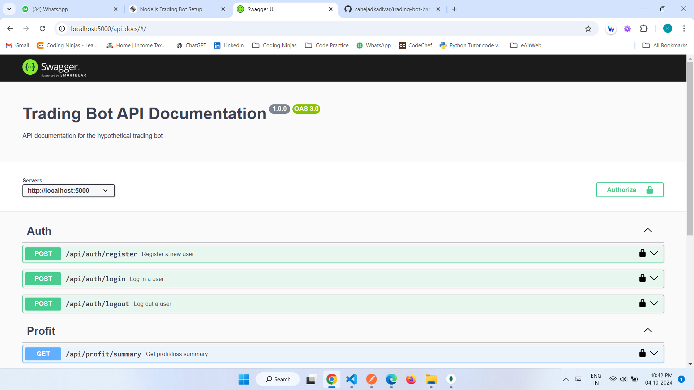
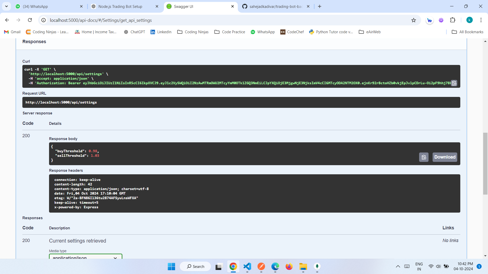
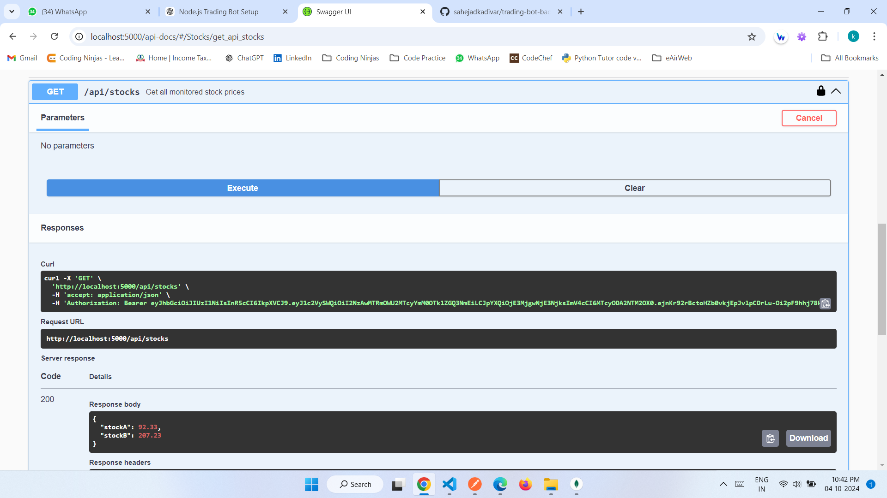

# Trading Bot API

## Description

The **Trading Bot API** is a backend application built with Node.js and MongoDB that simulates a basic trading bot for a hypothetical stock market. The bot executes trades based on predefined rules and conditions, tracking its profit/loss and performance metrics. It utilizes JWT for authentication and includes comprehensive Swagger documentation for API endpoints.

## Features

- **Authentication**: Secure user login and registration with JWT.
- **Trading Logic**: Implements simple trading strategies such as buy/sell thresholds.
- **Profit/Loss Tracking**: Monitors the bot's positions, balance, and overall profit/loss.
- **Settings Management**: Allows users to update trading thresholds and strategies.
- **Stock Monitoring**: Retrieves and displays stock prices using a mock API.

## Technologies Used

- Node.js
- Express.js
- MongoDB
- Mongoose
- JWT (JSON Web Tokens)
- Swagger for API documentation
- dotenv for environment variable management

## Getting Started

### Prerequisites

- Node.js (version 14 or higher)
- MongoDB (local or remote)
- npm (Node package manager)

### Installation

1. Clone the repository:

   ```bash
   git clone https://github.com/sahejadkadivar/trading-bot-backend.git
   cd trading-bot-backend
2. Install dependencies:
   ```bash
   npm install
3. Create a .env file in the root directory and add your environment variables:
   ```bash
   MONGO_URI=your_mongodb_connection_string
   JWT_SECRET=your_jwt_secret
   PORT=5000
4. Start the server:
   ```bash
   node server.js


## API Documentation

### API documentation is available at:
    ```bash
    http://localhost:5000/api-docs
    
## Screenshots







## Available Endpoints

- **Authentication**
    - `POST /api/auth/register`: Register a new user.
    - `POST /api/auth/login`: Log in a user.
    - `POST /api/auth/logout`: Log out a user.

- **Trading**
    - `POST /api/trades/execute`: Make a trade based on current stock price.
    - `POST /api/trades/all`: Get all trades.


- **Settings**
    - `GET /api/settings`: Retrieve current bot settings.
    - `POST /api/settings`: Update trading bot settings.

- **Stocks**
    - `GET /api/stocks`: Retrieve all monitored stock prices.

- **Profit**
    - `GET /api/profit/summary`: Retrieve all monitored stock prices.


## Contributing

Feel free to contribute to this project by creating issues or submitting pull requests. Your contributions are welcome!

## Authors

- [sahejadkadivar](https://github.com/sahejadkadivar)

## 🐦 Follow Me:

> [LinkedIn](https://www.linkedin.com/in/er-sahejad-kadivar-667bb9227/)


I hope you like the project. Thanks for reading :)
